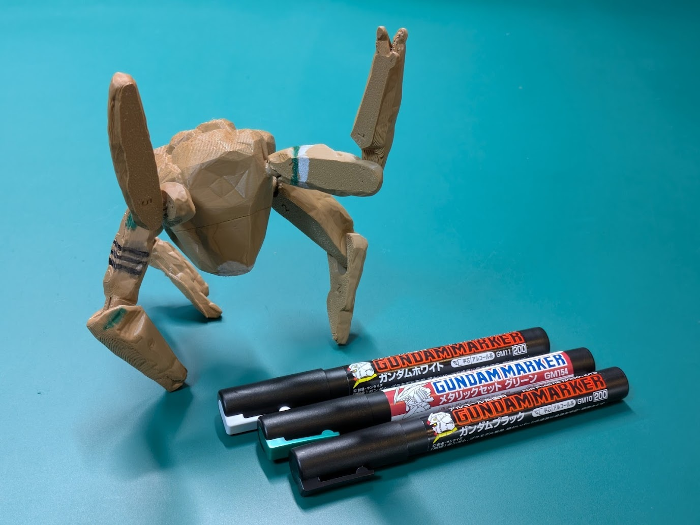
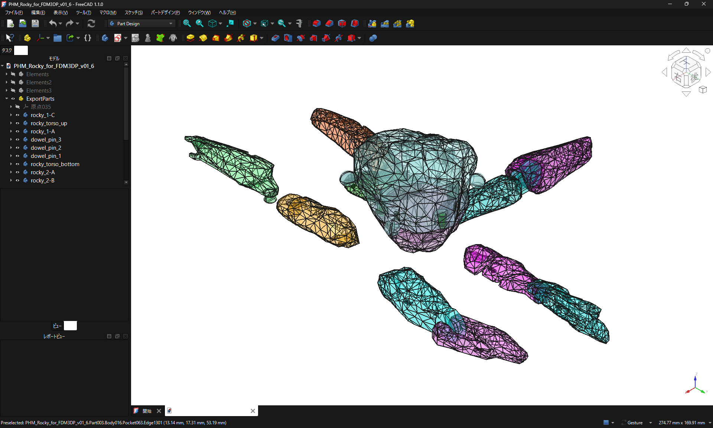
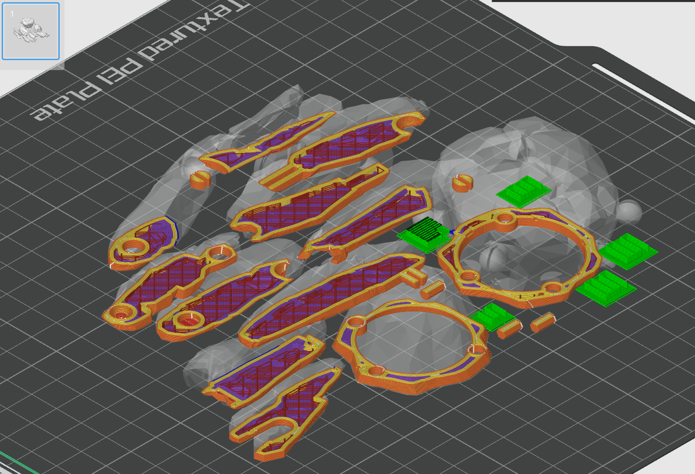

# PHM_Rocky_for_FDM3DP
プロジェクト・ヘイル・メアリーのロッキーのアクションフィギュアをFDM方式の3Dプリンター向けに再設計したものです。  
容易に印刷できるように設計されています。  
This is a redesign of Project Hail Mary's Rocky action figure for use with FDM 3D printers.  
It's designed to be easily printed.  
  
球体関節部分にだけサポート材をマニュアルで追加してください。  
Please manually add support material only to the ball joint area.  
  
  
  
  
